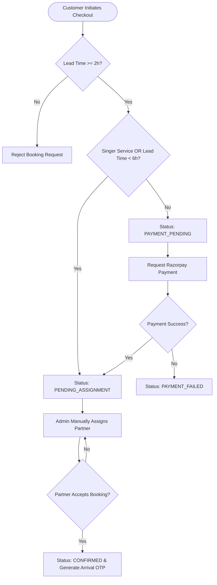
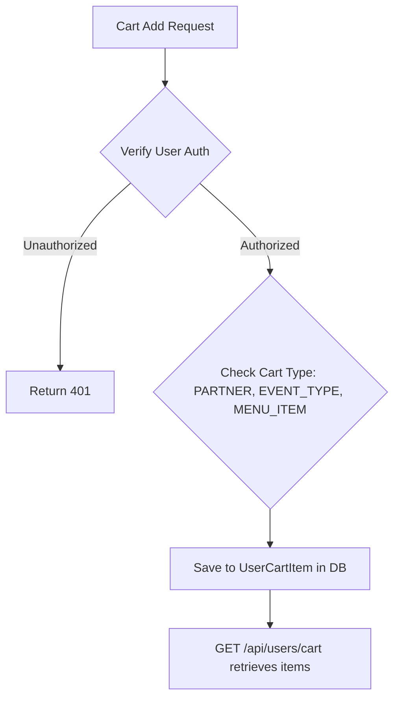
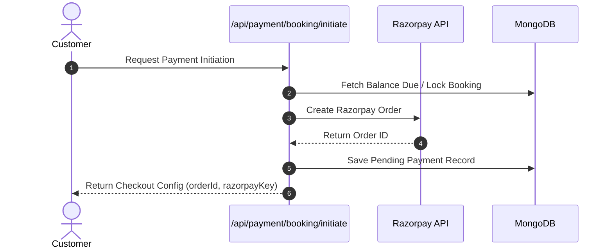
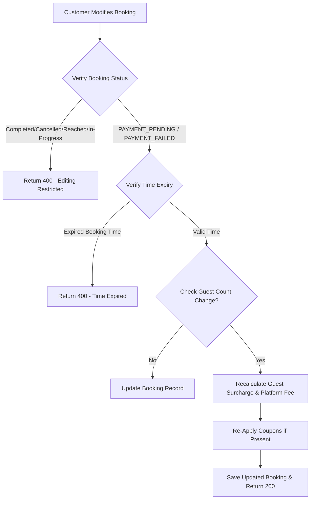

# Tastico Booking System Master Readme

This document represents the **current state of implementation** of the Tastico Booking System as of June 23, 2026. It documents only the features, architectures, models, enums, business rules, and API endpoints that exist in the codebase today. Idealized configurations or features not implemented are marked as `"Currently Not Implemented"`.

---

## Overview

Tastico is a Next.js web application designed to connect customers with approved service partners in India, providing on-demand hospitality and entertainment services. The platform facilitates booking, cart operations, custom menu items selection, ingredient calculation, secure payments via Razorpay, dynamic commission splits, and automated OTP-verified service lifecycles.

---

## Problem Statement

Traditional gig and event hosting services suffer from lack of verification of cooking/hospitality staff, untrustworthy billing for ingredients, and manual coordination errors. Tastico resolves these inefficiencies by offering a centralized platform that manages verified partner portfolios, tracks real-time service status, calculates transparent service and ingredient pricing, and enforces secure milestone handshakes.

---

## Solution

Tastico provides:
1.  **Direct Booking & Cart Management**: Enables customers to add service categories, custom menus, and event types to a persistent MongoDB cart.
2.  **Verified KYC Onboarding**: Allows partners to register by uploading legal documents (Aadhaar, PAN) and verification certificates, followed by admin approval.
3.  **Secure Milestone Lifecycles**: Enforces physical arrival and completion validation via cryptographically-generated 6-digit OTPs.
4.  **Integrated Billing**: Automatically computes commission splits, rescheduling fees, and ingredient totals using Razorpay.

---

## Business Model

The platform generates revenue through:
1.  **Slab-Based Service Commissions**: Calculated dynamically on the total service charge for bookings.
2.  **Partner Registration Fee**: A fixed onboarding fee of ₹999 required for partner registration approval.
3.  **Rescheduling Surcharges**: A fixed fee of ₹200 for rescheduling confirmed or pending bookings.

### Slab-Based Partner Service Commission Rules

Commissions are split between the partner and the platform based on the following total service charge slabs:

| Service Charge Slab (INR) | Partner Payout Share (%) | Platform Commission Share (%) |
| :--- | :--- | :--- |
| **0 – 999** | 100% | 0% |
| **1000 – 1999** | 70% | 30% |
| **2000 – 2999** | 60% | 40% |
| **3000 – 4999** | 50% | 50% |
| **5000+** | 40% | 60% |


---

## Core Features

1.  **Cart System**: Add, update, and remove service categories, menu items, or event types in a user cart.
2.  **Lead-Time Booking Checks**: Enforces a minimum 2-hour lead time before booking execution.
3.  **Dynamic Pricing**: Auto-calculates guest count additions and flat rates for waiters, bartenders, cleaners, or live singers.
4.  **Coupon Validation**: Validates coupon status, expiry date, minimum booking amount, and user usage limits.
5.  **Admin Assignment Dashboard**: Allows admins to assign, cancel, or reassign service partners to bookings.
6.  **Partner Verification OTP System**: Generation of arrival and completion OTPs with automated email triggers.
7.  **Rescheduling Gateway**: Processes ₹200 fee to modify booking dates/times.
8.  **Post-Event Rating & Reviews**: Allows rating of partners, menu items, and staff.
9.  **Ingredient Ordering & Payout**: Allows calculating and paying for ingredients separately for bookings.

---

## User Roles

Role-Based Access Control (RBAC) is implemented via the `UserRole` enum. Granular permissions and restrictions are listed below:

| Role | Description & Permissions | Restrictions |
| :--- | :--- | :--- |
| **Guest User** | Unauthenticated user. Can browse services, menu items, and event packages. | Cannot checkout, add to cart, or view profile info. |
| **CUSTOMER** | Authenticated customer. Can create bookings, manage cart, apply coupons, pay via Razorpay, request rescheduling, order ingredients, rate service partners. | Restricted from admin dashboards, approving partners, manually assigning partners, or modifying bookings once in progress. |
| **PARTNER** | Authenticated service partner. Can accept/reject assigned bookings, input OTPs to update status, track personal assignments and payouts. | Cannot self-approve, modify billing details, or view other partners' assignments. |
| **ADMIN** | Authenticated admin. Access to admin dashboard, approve/reject partner KYC documents, add additional charges, manually assign partners. | Cannot bypass database validation protocols. |
| **SUPER_ADMIN** | Has full system admin access, including administrative management of other admins. | None. |


---


## Booking Architecture

### Complete Booking Flow
The booking flow is managed dynamically. Depending on the lead time or services selected, a booking starts as either `PAYMENT_PENDING` or `PENDING_ASSIGNMENT`.



*   **Source File**: `src/app/api/users/booking/create/route.ts`
*   **Source Function**: `POST()`, `calculateBill()`, `to24Hour()`

### Menu Selection & Cart Flow
Items are added to the database cart (`UserCartItem` model) and validated before booking.




### Pricing Engine Formulas
Pricing calculations are performed dynamically on checkout:

$$\text{Total Amount} = \text{Cook Charge} + \text{Chef Charge} + \text{Waiter Charge} + \text{Bartender Charge} + \text{Cleaner Charge} + \text{Singer Charge} + \text{Ingredient Total} + \text{Platform Fee} + \text{Event Charges}$$

Where:
*   $\text{Guest Amount} = \text{Guest Rate} \times \text{Guest Count}$ (if Service Category is SINGER, $\text{Guest Amount} = 0$).
*   $\text{Cook Charge} = \text{Menu Total} + \text{Guest Amount}$ (applicable only if Service contains `COOK`).
*   $\text{Chef Charge} = \text{Menu Total} + \text{Guest Amount}$ (applicable only if Service contains `CHEF`).
*   $\text{Waiter, Bartender, Cleaner, Singer Charges}$ are flat rates passed from the client payload.


### Advance Payment Logic
For initial checkout, if nothing has been paid yet (`totalPaid === 0`) and the payment type is requested as `"ADVANCE"`, customers can pay a partial deposit for `CHEF`, `COOK`, or `BARTENDER` categories:

$$\text{Advance Payment Amount} = \text{Math.ceil}\left(\frac{\text{Booking Total Amount} \times (100 - \text{Partner Percentage})}{100}\right)$$

Where $\text{Partner Percentage}$ is resolved from `getPartnerPercentage(totalAmount)`.

---

## Payment Architecture

All financial transactions are integrated with Razorpay in Indian Rupees (INR).




---

## Refund Architecture

*   `Currently Not Implemented`

Although the `Refund` database model and `RefundStatus` enum are defined in the schema, no backend API routes or controllers exist in the project codebase today to process automated or manual refunds.


## Assignment Architecture

### Partner Assignment Flow
Partner assignment is executed **manually by system admins** from the admin dashboard.

```mermaid
flowchart TD
    A[Admin Initiates Assignment] --> B{Verify Partner ID & Role}
    B -- Non-Partner/Missing -- Host Error --> C[Return 400/404]
    B -- Valid Partner --> D{Verify Service Category Compatibility}
    D -- Mismatch --> E[Return 400 - Mismatch]
    D -- Compatible --> F{Check Active Booking State}
    F -- Cancelled / Completed --> G[Return 400 - Terminal State]
    F -- Active --> H{Verify Partner Not Already Assigned}
    H -- Already Assigned --> I[Return 400 - Duplicate]
    H -- Fresh Assignment --> J[Write BookingPartner record & Update Booking Status to ASSIGNED]
```


## Booking Modification Flow

Customers can edit booking metadata (guest count, timing, location, instructions) before payment.




---

## Cancellation Policy Engine

The cancellation policy is checked when a customer initiates cancellation:

*   **Direct Customer Cancellations**: Allowed only if status is not in `["COMPLETED", "CANCELLED", "IN_PROGRESS", "REACHED"]`.
*   **Business Rules Enforced**:
    *   Cancel before 24 hours $\rightarrow$ 50% refund.
    *   Cancel within 24 hours $\rightarrow$ No refund.
    *   Put booking on hold for ₹199 (valid for 1 month).
*   *Note on Implementation*: The backend currently sets status to `"CANCELLED"` and notifies assigned partners. The financial refund distribution is not automated in the codebase today.

*   **Source File**: `src/app/api/users/booking/my/[id]/route.ts`, `src/data/contact-us.tsx`
*   **Source Function**: `PATCH()` inside `src/app/api/users/booking/my/[id]/route.ts`

---

## SLA Definitions

*   `Currently Not Implemented`

---

## Codebase Edge Cases

The following edge cases are explicitly handled in the project logic:

### 1. Lead Time Check Violation
*   **Trigger**: Booking creation request submitted with less than 2 hours lead time before the event starts.
*   **Mitigation**: Blocked at backend. Returns a 400 Bad Request error.


### 2. Urgent Booking Trigger
*   **Trigger**: Booking lead time is between 2 to 6 hours.
*   **Mitigation**: Bypasses the initial checkout payment requirement and sets the booking status directly to `PENDING_ASSIGNMENT` for admin triage.

### 3. SINGER Service Booking Payment Bypass
*   **Trigger**: Customer selects SINGER in the service categories.
*   **Mitigation**: SINGER services require admin approval first. Bypasses checkout payment and marks status as `PENDING_ASSIGNMENT`.


### 4. Overlapping Rescheduling Midnight Crossing
*   **Trigger**: A rescheduling request sets the start time late in the evening and the end time crosses midnight.
*   **Mitigation**: The system automatically adds 1 day to the end date timestamp to maintain logical consistency.

### 5. Edits to Paid Bookings
*   **Trigger**: User attempts to edit booking details on a booking that has already been paid for.
*   **Mitigation**: Blocked. The system throws a 400 error stating that only unpaid bookings can be edited.

### 6. Booking Edits Post-Expiration
*   **Trigger**: User attempts to edit a booking whose scheduled start time has already passed.
*   **Mitigation**: Blocked at backend. Returns a 400 error stating that the booking time has expired.

### 7. Direct Free Rescheduling Bypass
*   **Trigger**: Customer requests booking rescheduling directly without making a payment.
*   **Mitigation**: Blocked. Returns a 402 payment required response requiring a ₹200 gateway transaction fee.

### 8. Ingredients Order in Closed Bookings
*   **Trigger**: Customer attempts to add ingredients to a booking that is already CANCELLED or COMPLETED.
*   **Mitigation**: Blocked. Throws a 400 bad request error.

### 9. Multiple Ingredient Orders
*   **Trigger**: Customer attempts to submit an ingredients order when ingredients have already been added.
*   **Mitigation**: Blocked. Throws a 409 conflict error.

### 10. Partner Double Assignment
*   **Trigger**: Admin attempts to assign the same partner twice to the same booking category.
*   **Mitigation**: System checks existing assignments and returns a 400 error.

### 11. Partner Category Check Failure
*   **Trigger**: Admin attempts to assign a partner to a service category they are not qualified for.
*   **Mitigation**: System checks the partner's profile capabilities and returns a 400 error.

### 12. Partner Acceptance of Expired Booking
*   **Trigger**: Partner attempts to accept a booking assignment after the event's end time.
*   **Mitigation**: Checks the event timeline and returns a 400 error.

### 13. Double Arrival OTP Verification
*   **Trigger**: Partner attempts to verify arrival OTP on a booking that has already had its arrival OTP used.
*   **Mitigation**: Checked in the OTP metadata and returns a 400 error.

### 14. Partner Registration Payment Recovery
*   **Trigger**: Partner has created a profile, but email verification or registration payment is pending.
*   **Mitigation**: The system detects the exact registration state during registration attempts, sends a new verification OTP, and redirects to the payment step.

### 15. KYC Incomplete Partner Payment Block
*   **Trigger**: Partner attempts to initiate registration payment before completing KYC details.
*   **Mitigation**: Blocked. Checks the existence of KYC documents and returns a 400 error.
